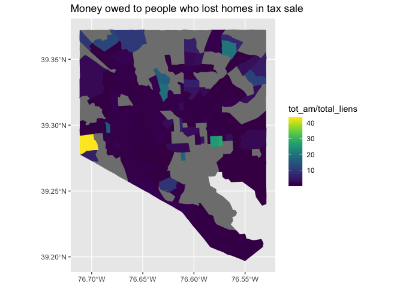

Excess Funds
================
Nick Thieme
2023-02-06

### Introduction

This is the code that goes with the story
`Tax sale foreclosure costs Baltimore residents their homes and equity. The city does nothing to help them get the small amount they’re owed`
located
[here](https://www.thebaltimorebanner.com/community/housing/baltimore-city-tax-sale-foreclosure-funds-TWQXWYNBNJGABKYCDMCFCZ7WCM/).
In this story, Sophie Kasakove and I take a look at the excess funds
list–the amount of money the City of Baltimore owes to property owners
who have lost their homes through tax sale foreclosure.

### Parsing the data

The statistics in this story are very simple. The only slight difficulty
is turning the excess funds pdf into a csv. We do that in this code
chunk here.

``` r
# D<-pdf_text("~/Downloads/RP26806D_120122103239.pdf")
# 
# D_2<-D[3:(length(D)-8)] %>% lapply(
#   function(x){
#     x_new<-x %>% str_split("\\n") %>% lapply(., trimws)
#     return(x_new[[1]])
#   }
# )
# 
# D_2_index<-D_2%>% lapply(
#   function(x){
#     index <- str_detect(str_sub(x, 1,3), "[0-9]{2} ") %>% which
#     return(index)
#   }
# )
# 
# D_excess_funds<-tibble()
# 
# for(i in 1:length(D_2)){
# 
#   index <- D_2_index[[i]]
# 
#   if(length(index)<2){
#     next
#     print("lenght less than 2")
#   }
# 
#   for(j in 1:(length(index)-1)){
#     curr_entries<-D_2[[i]][index[j]:(index[j+1]-1)]
#     empties<-which(curr_entries=="")
#     curr_entries_new <- curr_entries[-empties]
# 
#     possible_unclaimed_amounts<-(curr_entries_new %>% str_split("   ") )[[1]]%>% str_remove(",") %>% trimws
#     period_locations<- possible_unclaimed_amounts %>% str_detect("\\.")
#     unclaimed_amount<-possible_unclaimed_amounts[period_locations]%>% as.numeric %>% na.omit
# 
#     possible_lien_amounts <- (curr_entries_new %>% str_split("   "))[[2]]%>% str_remove(",") %>% trimws
# 
#     if(length(possible_lien_amounts)==1){
#       total_lien <- possible_lien_amounts
#     }else{
#       empty_to_rm<-which(possible_lien_amounts=="")
#       total_lien_candidates<-possible_lien_amounts[-empty_to_rm]
#       period_locations<-which(total_lien_candidates %>% str_detect("\\."))
#       total_lien <- total_lien_candidates[period_locations]
#     }
# 
#     options_new<- curr_entries_new[1] %>% str_remove(unclaimed_amount %>% as.character) %>% str_sub(.,15, nchar(.))
# 
#     addr<-options_new %>% trimws %>% str_split("  ") %>%   lapply(function(x)return(x[[1]])) %>% unlist %>% str_remove_all("\\*")
# 
#     name<- options_new %>% str_remove(addr) %>% trimws %>%str_split("      ") %>%  lapply(function(x)return(x[[1]])) %>% unlist %>% str_remove_all("\\**") %>%
#       str_remove("\\(") %>% str_remove("\\)")
# 
#     if(nchar(name)>0){
#       dates<-options_new %>% str_remove(addr) %>% str_remove(name) %>% trimws %>% str_split("  ")
#     }else{
#       break
#       print("name issue")
#     }
# 
#     tax_sale_date<-dates[[1]][1] %>% trimws
#     deed_delivered_date <- dates[[1]][3] %>% trimws
# 
#     D_row = tibble(property_address = addr, owner_name = name, tax_sale_date, deed_delivered_date, unclaimed_amount, total_lien)
#     D_excess_funds <- rbind(D_excess_funds, D_row)
# 
#   }
# 
#   nchars_tot <- nchar(D_2[[i]]) %>% sum
# 
#   if(nchars_tot<20){
#     print("not enough letters")
#     break
#   }
# 
#   curr_entries<-D_2[[i]][index[length(index)]:length(D_2[[i]])]
#   empties<-which(curr_entries=="")
#   curr_entries_new <- curr_entries[-empties]
# 
#   possible_unclaimed_amounts<-(curr_entries_new %>% str_split("   ") )[[1]]%>% str_remove(",") %>% trimws
#   period_locations<- possible_unclaimed_amounts %>% str_detect("\\.")
#   unclaimed_amount<-possible_unclaimed_amounts[period_locations]%>% as.numeric %>% na.omit
# 
#   inds<-(curr_entries_new %>% str_split("   "))
# 
#   if(length(inds)==1){
#     options_new<- curr_entries_new[1] %>% str_remove(unclaimed_amount %>% as.character) %>% str_sub(.,15, nchar(.))
# 
#     addr<-options_new %>% trimws %>% str_split("   ") %>%   lapply(function(x)return(x[[1]])) %>% unlist %>% str_remove("\\(") %>% str_remove("\\)") %>%
#       str_remove_all("\\*")
# 
#     name<- options_new %>% str_remove(addr) %>% trimws %>%str_split("      ") %>%  lapply(function(x)return(x[[1]])) %>% unlist%>% str_remove("\\(") %>%
#       str_remove("\\)")%>%
#       str_remove_all("\\*")
# 
#     dates<-options_new %>% str_remove(addr) %>% str_remove(name) %>% trimws %>% str_split("  ")
#     tax_sale_date<-dates[[1]][1] %>% trimws
#     deed_delivered_date <- dates[[1]][3] %>% trimws
# 
#     D_row = tibble(property_address = addr, owner_name = name, tax_sale_date, deed_delivered_date, unclaimed_amount, total_lien=NA)
#     D_excess_funds <- rbind(D_excess_funds, D_row)
# 
#     next
#   }
# 
#   possible_lien_amounts <- (curr_entries_new %>% str_split("   "))[[2]]%>% str_remove(",") %>% trimws
# 
#   if(length(possible_lien_amounts)==1){
#     total_lien <- possible_lien_amounts
#   }else{
#     empty_to_rm<-which(possible_lien_amounts=="")
#     total_lien_candidates<-possible_lien_amounts[-empty_to_rm]
#     period_locations<-which(total_lien_candidates %>% str_detect("\\."))
#     total_lien <- total_lien_candidates[period_locations]
#   }
# 
#   options_new<- curr_entries_new[1] %>% str_remove(unclaimed_amount %>% as.character) %>% str_sub(.,15, nchar(.))
# 
#   addr<-options_new %>% trimws %>% str_split("      ") %>%   lapply(function(x)return(x[[1]])) %>% unlist%>% str_remove("\\(") %>% str_remove("\\)")%>%
#     str_remove("\\*")
# 
#   name<- options_new %>% str_remove(addr) %>% trimws %>%str_split("      ") %>%  lapply(function(x)return(x[[1]])) %>% unlist%>% str_remove("\\(") %>%
#     str_remove("\\)")
# 
#   dates<-options_new %>% str_remove(addr) %>% str_remove(name) %>% trimws %>% str_split("  ")
#   tax_sale_date<-dates[[1]][1] %>% trimws
#   deed_delivered_date <- dates[[1]][3] %>% trimws
# 
#   D_row = tibble(property_address = addr, owner_name = name, tax_sale_date, deed_delivered_date, unclaimed_amount, total_lien)
#   D_excess_funds <- rbind(D_excess_funds, D_row)
# 
# }
# 
# D_excess_funds_f<-D_excess_funds %>%
#   mutate(tax_sale_date = mdy(tax_sale_date), deed_delivered_date = mdy(deed_delivered_date), total_lien = as.numeric(total_lien)) %>%
#   na.omit
# 
# D_excess_funds_f %>%
#   mutate(
#     property_address = str_c(str_remove_all(property_address, ", Baltimore, Maryland")%>% str_remove(., "^0+"), ", Baltimore, Maryland")
#     )%>% 
#   write_csv("~/Desktop/banner_projects/real_estate/excess_funds_list_3.csv")
```

Unsurprisingly, the majority of the funds owed by the City are located
in the Black Butterly. This makes sense because excess funds are
downstream of sold homes, and sold homes are in the Black Butterfly. All
of the homes identified as sold through tax sale since 2016 have been in
Black Butterfly. The reason why we see excess funds outside this area at
all is because the excess funds list has no expiration date on it. We
write out the geojson for this here.

``` r
Bmore_acs<-get_acs(geography = "tract", state = "MD",county = "Baltimore city",
                   variables=c(med_inc="B19013_001",white = "B02001_002", 
                               black = "B02001_003", 
                               poverty = "B17001_002"), geometry = T, summary_var = "B01001_001"
)%>% pivot_wider(-c(GEOID, moe),names_from = "variable", values_from = "estimate") %>% 
  mutate(blk_perc = black/summary_est, wht_perc = white/summary_est, pov_rate = poverty/summary_est) %>% st_as_sf
```

    ## Getting data from the 2016-2020 5-year ACS

    ## Downloading feature geometry from the Census website.  To cache shapefiles for use in future sessions, set `options(tigris_use_cache = TRUE)`.

    ##   |                                                                              |                                                                      |   0%  |                                                                              |=                                                                     |   1%  |                                                                              |=                                                                     |   2%  |                                                                              |==                                                                    |   2%  |                                                                              |===                                                                   |   4%  |                                                                              |===                                                                   |   5%  |                                                                              |====                                                                  |   5%  |                                                                              |====                                                                  |   6%  |                                                                              |=====                                                                 |   7%  |                                                                              |======                                                                |   8%  |                                                                              |======                                                                |   9%  |                                                                              |=======                                                               |  10%  |                                                                              |=======                                                               |  11%  |                                                                              |========                                                              |  11%  |                                                                              |========                                                              |  12%  |                                                                              |=========                                                             |  13%  |                                                                              |==========                                                            |  15%  |                                                                              |===========                                                           |  16%  |                                                                              |============                                                          |  17%  |                                                                              |============                                                          |  18%  |                                                                              |=============                                                         |  19%  |                                                                              |===============                                                       |  21%  |                                                                              |===============                                                       |  22%  |                                                                              |================                                                      |  22%  |                                                                              |=================                                                     |  24%  |                                                                              |=================                                                     |  25%  |                                                                              |==================                                                    |  25%  |                                                                              |====================                                                  |  28%  |                                                                              |====================                                                  |  29%  |                                                                              |=====================                                                 |  29%  |                                                                              |=======================                                               |  33%  |                                                                              |=========================                                             |  36%  |                                                                              |===========================                                           |  39%  |                                                                              |=============================                                         |  41%  |                                                                              |===============================                                       |  45%  |                                                                              |===================================                                   |  51%  |                                                                              |========================================                              |  57%  |                                                                              |=========================================                             |  59%  |                                                                              |==========================================                            |  60%  |                                                                              |===========================================                           |  61%  |                                                                              |===============================================                       |  68%  |                                                                              |=================================================                     |  70%  |                                                                              |=====================================================                 |  75%  |                                                                              |======================================================                |  77%  |                                                                              |=========================================================             |  82%  |                                                                              |==============================================================        |  89%  |                                                                              |===================================================================   |  95%  |                                                                              |===================================================================== |  99%  |                                                                              |======================================================================| 100%

``` r
D_excess_funds_geocoded <- read_csv("~/Desktop/banner_projects/real_estate/excess_funds_list_2_geocodio_1701cf4c732b384328a711a38efa2ea91c4829a0.csv") %>% 
  select(property_address, owner_name,tax_sale_date,deed_delivered_date,unclaimed_amount,total_lien,Latitude,Longitude) %>% 
  st_as_sf(coords = c("Longitude", "Latitude"))
```

    ## Rows: 2132 Columns: 20

    ## ── Column specification ────────────────────────────────────────────────────────
    ## Delimiter: ","
    ## chr  (12): property_address, owner_name, Accuracy Type, Number, Street, Unit...
    ## dbl   (6): unclaimed_amount, total_lien, Latitude, Longitude, Accuracy Score...
    ## date  (2): tax_sale_date, deed_delivered_date
    ## 
    ## ℹ Use `spec()` to retrieve the full column specification for this data.
    ## ℹ Specify the column types or set `show_col_types = FALSE` to quiet this message.

``` r
st_crs(D_excess_funds_geocoded)<-st_crs(Bmore_acs)

D_excess_acs<-Bmore_acs %>% st_join(D_excess_funds_geocoded)
D_excess_acs_points<-Bmore_acs %>% st_join(D_excess_funds_geocoded)

##black butterfly
D_excess_acs_cens<-D_excess_acs %>% data.frame %>% #filter(tax_sale_date>ymd("2018-01-01")) %>% 
  group_by(NAME) %>% 
  summarise(tot_am = sum(unclaimed_amount), 
            total_liens = sum(total_lien),
            geometry = geometry[1], 
            n = n(), 
            blk_perc=blk_perc[1]) %>% 
  mutate(tot_am = replace_na(tot_am,0)) %>% st_as_sf

D_excess_acs_cens %>% ggplot(aes(color = tot_am/total_liens, fill = tot_am/total_liens))+geom_sf()+scale_color_viridis()+scale_fill_viridis()+
  labs(title = "Money owed to people who lost homes in tax sale")
```

<!-- -->

``` r
props<-D_excess_acs_cens %>% st_transform(4326) %>% add_column(id = 1:nrow(.))

st_write(props%>% select(geometry) %>% add_column(id = 1:nrow(.)), dsn = "~/Desktop/banner_projects/real_estate/excess_funds.geojson",
         layer = "city_tracts", driver = "GeoJSON", delete_dsn = T)
```

    ## Deleting source `/Users/nickthieme/Desktop/banner_projects/real_estate/excess_funds.geojson' using driver `GeoJSON'
    ## Writing layer `city_tracts' to data source 
    ##   `/Users/nickthieme/Desktop/banner_projects/real_estate/excess_funds.geojson' using driver `GeoJSON'
    ## Writing 199 features with 1 fields and geometry type Multi Polygon.

``` r
props%>% data.frame  %>% write_csv("~/Desktop/banner_projects/real_estate/excess_funds.csv")
```

Here we run the simple statistics we use in the story

``` r
#amounts
#D_excess_acs_points %>% arrange(desc(unclaimed_amount)) %>% head(10) %>% select(property_address,deed_delivered_date, unclaimed_amount)

D_excess_acs_points %>% filter(unclaimed_amount>20000) %>% nrow 
```

    ## [1] 55

``` r
D_excess_acs_points %>% filter(unclaimed_amount>80000) %>% nrow  
```

    ## [1] 9

``` r
D_excess_acs_points %>% pull(unclaimed_amount) %>% na.omit %>%  median  
```

    ## [1] 582.16

``` r
D_excess_funds_geocoded %>% mutate(time_since_deed = ymd("2022-01-01")-deed_delivered_date) %>% pull(time_since_deed) %>% mean
```

    ## Time difference of 2549.365 days

We use having ” LL” in the owner name as a proxy for the number of homes
that are owned by LLC’s as opposed to individuals.

``` r
###connecting the city building data with the excess funds list 
# j_city_state_data_sf<-st_read("~/Desktop/banner_projects/real_estate/fixed_parcel_data.shp") 
# name_file_shapes <- read_csv("~/Desktop/banner_projects/real_estate/fixed_parcel_names.csv" )
# names(j_city_state_data_sf)<-name_file_shapes$`names(j_city_state_data_sf)`
# 
# D_excess_funds_match_f<-D_excess_funds_f_pm_2_add_f %>%
#   mutate(pm.house = pm.house %>% str_remove(., "^0+") %>% str_remove(., ">"))%>% 
#   mutate(pm.house=str_split(pm.house,"-") %>% lapply(function(x)return(x[1])) %>% unlist,
#          pm.preDir=replace_na(pm.preDir,""),
#          pm.streetSuf=replace_na(pm.streetSuf,""),
#          pm.addr.full = str_c(pm.house, " ",pm.preDir, " ",pm.address," ", pm.streetSuf) %>% trimws %>% 
#            str_replace("  "," ") %>% str_replace("  "," ") %>% tolower) %>% select(pm.uid,pm.addr.full)%>%
#   mutate(pm.addr.full = str_remove(pm.addr.full, "\\#+[0-9]*") %>% trimws %>% str_remove_all("\\.")) %>% 
#   rename(pm.addr.full.bidder = pm.addr.full)
# 
# D_excess_funds_match_f_n<-D_excess_funds_f_pm %>% left_join(D_excess_funds_match_f, by = "pm.uid") %>% 
#   select(-pm.id,-pm.uid, -pm.type) %>% as.data.frame
# 
# matched_excess_city_prop<-D_excess_funds_match_f_n %>% left_join(j_city_state_data_sf, by = c("pm.addr.full.bidder"="pm.addr.full.sdat"))
# 
# #checking missed matches. 28/2143 1.3%
# matched_excess_city_prop %>% filter(is.na(id_city)) %>% nrow

#2115 matched
# matched_excess_city_prop %>% filter(is.na(id_city)==FALSE) %>% nrow
# matched_excess_city_prop %>% filter(str_detect(owner_name, "LLC")) %>% nrow

D_excess_funds_geocoded %>% filter(str_detect(owner_name, " LL")) %>% nrow
```

    ## [1] 301

``` r
D_excess_funds_geocoded %>% nrow
```

    ## [1] 2132

``` r
D_excess_funds_geocoded %>% filter(str_detect(owner_name, " LL")) %>% pull(unclaimed_amount) %>% sum
```

    ## [1] 796198.1

``` r
D_excess_funds_geocoded %>% filter(str_detect(owner_name, " LL")==FALSE) %>% pull(unclaimed_amount) %>% sum
```

    ## [1] 5239482

``` r
D_excess_paid <- read_csv("~/Desktop/banner_projects/real_estate/ExcessFundsPaid.csv") %>% 
  mutate(total_e = `TOTAL-LIENS` %>% str_remove("\\$") %>% str_remove(",") %>% as.numeric,
         balance_e = BALANCE %>% str_remove("\\$") %>% str_remove(",") %>% as.numeric,
         amt_bid_e = `AMT-BID` %>% str_remove("\\$") %>% str_remove(",") %>% as.numeric,
         dd_date_e = `DD-DATE` %>% mdy,
         address = `PROPERTY-ADDRESS`,
         sale_date_e = `SALE-DATE`,
         dd_y = year(dd_date_e))
```

    ## Rows: 180 Columns: 17
    ## ── Column specification ────────────────────────────────────────────────────────
    ## Delimiter: ","
    ## chr (12): BLOCK, LOT, SALE-DATE, SALE-TYPE, LOT-SIZE, PROPERTY-ADDRESS, OWNE...
    ## dbl  (5): YEAR, TAXBASE, PROP-ZIP-CODE, CERT-NUM, OVER-PAY-NO
    ## 
    ## ℹ Use `spec()` to retrieve the full column specification for this data.
    ## ℹ Specify the column types or set `show_col_types = FALSE` to quiet this message.

``` r
D_excess_paid_pm<-D_excess_paid %>% pm_identify(var = "address")

D_excess_paid_pm_2<-D_excess_paid_pm%>% pm_prep(var = "address", type = "street") %>% 
  mutate(pm.address=pm.address %>% str_remove_all("\\.")) 

dirsDict <- pm_dictionary(type = "directional", locale = "us")

D_excess_paid_pm_2_unit_2<-D_excess_paid_pm_2 %>% 
  pm_house_parse() %>% pm_unit_parse() %>% select(pm.uid, pm.unit) %>% 
  mutate(pm.unit = str_c("unit ", pm.unit))

D_excess_paid_pm_2_add_f<-D_excess_paid_pm_2 %>% 
  pm_house_parse() %>% 
  pm_unit_parse() %>% 
  pm_streetDir_parse(dictionary = dirsDict) %>%
  pm_streetSuf_parse()%>%
  filter(is.na(pm.house)==FALSE,is.na(pm.address)==FALSE) %>% 
  mutate(pm.address = pm.address %>% str_split("#") %>% 
           lapply(.,
                  function(x){
                    return(x[1])
                  }
                    ) %>% unlist %>% trimws %>% str_remove("\\.")
         )

D_excess_paid_pm_match_3<-D_excess_paid_pm_2_add_f %>% left_join(D_excess_paid_pm_2_unit_2)%>%
  mutate(pm.house = pm.house %>% str_remove(., "^0+") %>% str_remove(., ">"),
         pm.house=str_split(pm.house,"-") %>% lapply(function(x)return(x[1])) %>% unlist,
         pm.preDir=replace_na(pm.preDir,""),
         pm.streetSuf=replace_na(pm.streetSuf,""),
         pm.unit=replace_na(pm.unit,""),
         pm.addr.full = str_c(pm.house, " ",pm.preDir, " ",pm.address," ", pm.streetSuf, " ", pm.unit) %>% trimws %>% 
           str_replace("  "," ") %>% str_replace("  "," ") %>% tolower) %>% select(pm.uid,pm.addr.full)%>%
  mutate(pm.addr.full = str_remove(pm.addr.full, "\\#+[0-9]*") %>% trimws %>% str_remove_all("\\.")) %>% 
  rename(pm.addr.full.bidder = pm.addr.full)
```

    ## Joining, by = "pm.uid"

``` r
D_excess_paid_pm_f<-D_excess_paid_pm %>% left_join(D_excess_paid_pm_match_3, by = "pm.uid") %>% 
  select(-pm.id,-pm.uid, -pm.type) %>% as.data.frame 

# join_paid_with_liens<-D_excess_paid_pm_f %>% mutate(sale_date_e = mdy(sale_date_e)) %>% 
#   left_join(liened_properties_f %>% mutate(sale_date_2=sale_date), by = c("pm.addr.full.bidder"="pm.addr.full.sdat", "sale_date_e"="sale_date"))
# 
# jj<-join_paid_with_liens %>%mutate(balance = amt_bid-total_liens) %>% 
#   select(paid_addr = pm.addr.full.bidder,lien_addr= property_address, sale_date_e = sale_date_e, 
#          sale_date_2, total_e, total_liens, balance_e, balance,amt_bid_e, amt_bid, dd_date_e)


D_excess_paid %>% group_by(dd_y) %>% summarise(amt = sum(balance_e), n = n())
```

    ## # A tibble: 4 × 3
    ##    dd_y      amt     n
    ##   <dbl>    <dbl> <int>
    ## 1  2020 1038330.    86
    ## 2  2021  894026.    42
    ## 3  2022  654373.    50
    ## 4  2023   12591.     2

``` r
D_excess_funds_geocoded %>% pull(unclaimed_amount) %>% sum
```

    ## [1] 6035680
