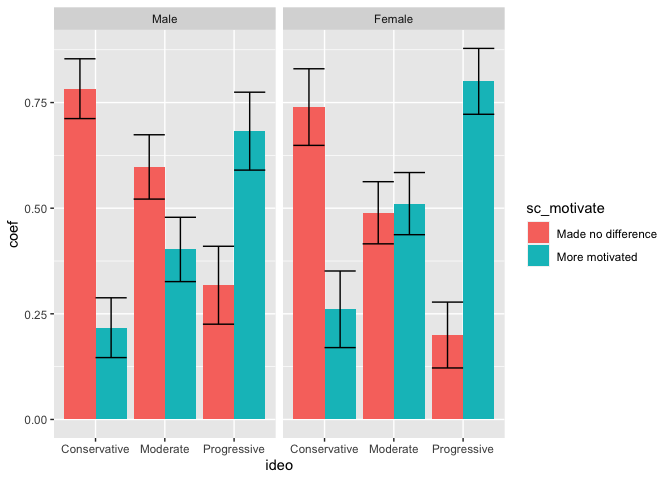

Banner General Poll
================
2022-09-20

## General Fall 2022 poll analysis

Another poll, another analysis. And another chance to learn something
about the electorate in Maryland while bringing some new stats methods
to the problem, as well.

First we load in the data and the libraries that we’ll be using for it.

## Abortion

I touch on this in the post a bit, but this poll analysis is really a
companion piece to the primary poll analysis I did a few months ago, in
much the same way that a general election is a companion to a midterm
election. A lot of the topics motivating voters are the same, and that
shows up in the interesting data questions.

We start by looking at the views Marylanders hold about abortions, and
whether they’ve been differentially motivated by Dobbs v. Jackson
ruling. We find that they have been, inways that I go into in the piece.
Below is the data we write out for the Flourish map, as well as the
single statistics that we call on.

``` r
srs_design_lv %>% filter(ideo%in%c(1,2,3) ,sc_motivate%in%c(2,3), gender%in%c(1,2)) %>% group_by(interact(gender,ideo),sc_motivate) %>%
  summarise(survey_prop("ci", .9)) %>% 
  mutate(sc_motivate = as_factor(sc_motivate),ideo = as_factor(ideo), gender = as_factor(gender)) %>% 
  ggplot(aes(x = ideo, fill = sc_motivate, y = coef))+geom_bar(stat="identity", position = "dodge")+
  geom_errorbar(aes(ymin= `_low`, ymax = `_upp`,x = ideo), position="dodge")+facet_grid(~gender)
```

<!-- -->

``` r
srs_design_lv  %>% group_by(ideo, gender, sc_motivate) %>% summarise(survey_prop()) %>% ungroup%>%mutate_all(as_factor) %>% filter(ideo == "Progressive", gender =="Female", sc_motivate=="More motivated")
```

    ## # A tibble: 1 × 5
    ##   ideo        gender sc_motivate    coef              `_se`             
    ##   <fct>       <fct>  <fct>          <fct>             <fct>             
    ## 1 Progressive Female More motivated 0.765795224093856 0.0496578663432208

``` r
srs_design_lv  %>% group_by(ideo, gender, sc_motivate) %>% summarise(survey_prop()) %>% ungroup%>%mutate_all(as_factor) %>% filter(ideo == "Conservative", gender =="Female", sc_motivate%in%c("Made no difference", "Less motivated")) %>% pull(coef) %>% as.character %>% as.numeric %>% sum
```

    ## [1] 0.6791028

``` r
srs_design_lv  %>% group_by(ideo, gender, sc_motivate) %>% summarise(survey_prop()) %>% ungroup%>%mutate_all(as_factor) %>% filter(ideo == "Conservative", gender =="Male", sc_motivate%in%c("Made no difference", "Less motivated")) %>% pull(coef) %>% as.character %>% as.numeric %>% sum
```

    ## [1] 0.7820895

``` r
srs_design_lv  %>% group_by(ideo, gender, sc_motivate) %>% summarise(survey_prop()) %>% ungroup%>%mutate_all(as_factor) %>% filter(ideo == "Moderate", gender =="Male", sc_motivate=="More motivated") 
```

    ## # A tibble: 1 × 5
    ##   ideo     gender sc_motivate    coef             `_se`           
    ##   <fct>    <fct>  <fct>          <fct>            <fct>           
    ## 1 Moderate Male   More motivated 0.38802060283588 0.04499828939212

``` r
srs_design_lv  %>% group_by(ideo, gender, sc_motivate) %>% summarise(survey_prop()) %>% ungroup%>%mutate_all(as_factor) %>% filter(ideo == "Moderate", gender =="Female", sc_motivate=="More motivated") 
```

    ## # A tibble: 1 × 5
    ##   ideo     gender sc_motivate    coef              `_se`             
    ##   <fct>    <fct>  <fct>          <fct>             <fct>             
    ## 1 Moderate Female More motivated 0.486186913422421 0.0433579230986239

## Race relations

There was an interesting high-level result that white respondents had
worse feelings about race relations than Black respondents, which, if
true, is an interesting point that supports particular ideological
views. However, if you look a little deeper into it, it doesn’t seem to
be true in the way it appears at the high level.

Below, I show the simple hypothesis test we perform in the article to
test for the high-level difference, as well as the closer examination
that we talk about in the article. I also calculate what percentage of
the Black electorate falls into the categories that seem to show a
difference.

``` r
srs_design %>%filter(race%in%c(1,2)) %>%  group_by(race,race_rel_2) %>% summarise(survey_prop()) %>% mutate_all(as_factor) %>% 
  filter(race_rel_2=="Good")
```

    ## `mutate_all()` ignored the following grouping variables:
    ## • Column `race`
    ## ℹ Use `mutate_at(df, vars(-group_cols()), myoperation)` to silence the message.

    ## # A tibble: 2 × 4
    ## # Groups:   race [2]
    ##        race race_rel_2 coef              `_se`             
    ##   <dbl+lbl> <fct>      <fct>             <fct>             
    ## 1 1 [White] Good       0.582035810733056 0.0241503712357803
    ## 2 2 [Black] Good       0.652088979312076 0.0312665512307464

``` r
srv_count_by_race_for_test<-srs_design %>%filter(race%in%c(1,2)) %>%  group_by(race,race_rel_2) %>% summarise(survey_count(.))

n_white_good<-srv_count_by_race_for_test %>% mutate(race = as_factor(race), race_rel_2 = as_factor(race_rel_2)) %>% filter(race=="White", race_rel_2=="Good") %>% unique() %>% pull(n)

n_black_good<-srv_count_by_race_for_test %>% mutate(race = as_factor(race), race_rel_2 = as_factor(race_rel_2)) %>% filter(race=="Black", race_rel_2=="Good") %>% unique() %>% pull(n)

n_tot_black <- srs_design %>% group_by(race) %>% summarise(survey_count(.)) %>% mutate(race = as_factor(race)) %>% filter(race=="Black") %>% pull(n) %>% unique

n_tot_white <- srs_design %>% group_by(race) %>% summarise(survey_count(.)) %>% mutate(race = as_factor(race)) %>% filter(race=="White") %>% pull(n) %>% unique

test<-prop.test(c(n_white_good, n_black_good), c(n_tot_white,n_tot_black)) # the difference is significant but small

srs_design %>%filter(race%in%c(1,2)) %>%  group_by(interact(race,ideo),race_rel_2) %>% summarise(survey_prop()) %>%
  mutate(ideo = as_factor(ideo), race_rel_2 = as_factor(race_rel_2)) %>% filter(ideo=="Conservative",race_rel_2 =="Good")
```

    ## # A tibble: 2 × 5
    ## # Groups:   race, ideo [2]
    ##        race ideo         race_rel_2  coef  `_se`
    ##   <dbl+lbl> <fct>        <fct>      <dbl>  <dbl>
    ## 1 1 [White] Conservative Good       0.577 0.0415
    ## 2 2 [Black] Conservative Good       0.785 0.0547

``` r
srs_design %>%filter(race%in%c(1,2)) %>%  group_by(interact(race,ideo),race_rel_2) %>% summarise(survey_prop()) %>%
  mutate(ideo = as_factor(ideo), race_rel_2 = as_factor(race_rel_2)) %>% filter(ideo=="Conservative",race_rel_2 =="Bad")
```

    ## # A tibble: 2 × 5
    ## # Groups:   race, ideo [2]
    ##        race ideo         race_rel_2  coef  `_se`
    ##   <dbl+lbl> <fct>        <fct>      <dbl>  <dbl>
    ## 1 1 [White] Conservative Bad        0.383 0.0412
    ## 2 2 [Black] Conservative Bad        0.153 0.0457

``` r
srs_design %>%mutate(region_code=as_factor(region_code)) %>% filter(race%in%c(1,2), region_code=="Baltimore County") %>%  group_by(interact(race,region_code),race_rel_2) %>% summarise(survey_prop()) %>% mutate(race = as_factor(race), race_rel_2 = as_factor(race_rel_2)) %>%  filter(race=="Black", race_rel_2=="Good")
```

    ## # A tibble: 1 × 5
    ## # Groups:   race, region_code [1]
    ##   race  region_code      race_rel_2  coef  `_se`
    ##   <fct> <fct>            <fct>      <dbl>  <dbl>
    ## 1 Black Baltimore County Good       0.676 0.0856

``` r
srs_design %>%mutate(region_code=as_factor(region_code)) %>% filter(race%in%c(1,2), region_code=="Baltimore County") %>%  group_by(interact(race,region_code),race_rel_2) %>% summarise(survey_prop()) %>% mutate(race = as_factor(race), race_rel_2 = as_factor(race_rel_2)) %>%  filter(race=="White", race_rel_2=="Good")
```

    ## # A tibble: 1 × 5
    ## # Groups:   race, region_code [1]
    ##   race  region_code      race_rel_2  coef  `_se`
    ##   <fct> <fct>            <fct>      <dbl>  <dbl>
    ## 1 White Baltimore County Good       0.449 0.0644

``` r
tot_black<-srs_design %>% mutate(race = as_factor(race)) %>% filter(race=="Black") %>% pull(weight) %>% sum

black_conservatives<-srs_design %>% mutate(race = as_factor(race), ideo = as_factor(ideo)) %>% filter(race=="Black", ideo=="Conservative") %>% pull(weight) %>% sum

black_not_cons_balt_cou<-srs_design %>% mutate(race = as_factor(race), ideo = as_factor(ideo), region_code = as_factor(region_code)) %>% filter(race=="Black", ideo!="Conservative", region_code =="Baltimore County") %>% pull(weight) %>% sum

#30 %
(black_not_cons_balt_cou+black_conservatives)/tot_black
```

    ## [1] 0.3017437

## Isomap

Lastly, we have what I find, as a methods-loving statistician, the most
fun part of the analysis–some dimensionality reduction tricks. I mention
this in the article a little bit, but it’s worthwhile to have some kind
of way to visualize a high-dimensional space as a lower dimensional
space. Of course, a poll, in some ways, represents an ideal
high-dimensional space with a lower-dimensional subspace representation.
While there are many questions on the poll, each of which could be
viewed as a dimension, there are far fewer “kinds of opinions.” Many of
these dimensions correlate with one another, but, intuitively, political
opinions admit a representation.

In general, I’m partial to non-linear dimensionality reduction
techniques. Compare how PCA does on the famous Swiss roll set to
non-linear embeddings and you’ll see what I mean. To go into probably a
little too much detail, many dimensionality reduction techniques
function in effectively the same way. You define a metric, calculate
distances using that metric, do an eigenvalue decomposition, and reduce
the dimension by picking a certain number of top eigenvalues.

Isomap uses a path-based distance. You define a neighborhood around each
point, connect it to its neighbors, and the calculate distances between
points by counting the length of the path from one point to another. The
goal with that is to preserve the local structure of the data.

We apply this method to the polling data to interesting effect. For one,
it’s clear that there is local structure that the data is pulling out.
But we also learn some interesting things from viewing the data in this
way that I talk about in the article.

``` r
D_for_diff_lv<-srs_design_lv$variables %>%mutate(
  hoganjob = case_when(hoganjob%in%c(1,2)~2,
                        hoganjob%in%c(3,4)~1),
  
  mdecon = case_when(mdecon%in%c(1)~1,
                     mdecon%in%c(2)~2),
  
  price = case_when(price%in%c(1)~2,
                    price%in%c(2,3)~1),
  
  bidenjob = case_when(bidenjob%in%c(3,4)~2,
                       bidenjob%in%c(1,2)~1),
  
  trumpfav = case_when(trumpfav%in%c(1,2)~1,
                       trumpfav%in%c(3,4)~2),
  
  racism = case_when(racism%in%c(1,2)~1,
                     racism%in%c(3,4)~2),
  
  crt = case_when(crt%in%c(1,2)~1,
                  crt%in%c(3,4)~2),
  
  vaccine = case_when(vaccine%in%c(1,2)~1,
                      vaccine%in%c(3,4)~2),
  
  parents = case_when(parents%in%c(1,2)~1,
                      parents%in%c(3,4)~2),  
  
  # crime = case_when(crime%in%c(1,2)~1,
  #                   crime%in%c(3)~2),  excluding crime from this analysis because i don't think there's a way to justify it with what we have
  
  race_rel = case_when(race_rel%in%c(1,2)~1,
                       race_rel%in%c(3,4)~2),  
  
  covid_over = case_when(covid_over%in%c(1,2)~2,
                         covid_over%in%c(3)~1),
  
  pubsafety = case_when(pubsafety%in%c(0)~2,
                         pubsafety%in%c(1)~1),
  
  econtax = case_when(econtax%in%c(0)~2,
                      econtax%in%c(1)~1),
  
  pubsch = case_when(pubsch%in%c(0)~2,
                     pubsch%in%c(1)~1),

  infra = case_when(infra%in%c(0)~2,
                    infra%in%c(1)~1),
  
  pubtransit = case_when(pubtransit%in%c(0)~2,
                         pubtransit%in%c(1)~1),
  
  environment = case_when(environment%in%c(0)~2,
                          environment%in%c(1)~1),
  
  housing = case_when(housing%in%c(0)~2,
                      housing%in%c(1)~1),
  
  issue_oth = case_when(issue_oth%in%c(0)~2,
                        issue_oth%in%c(1)~1),
  
  sc_motivate = case_when(sc_motivate%in%c(1,2)~2,
                          sc_motivate%in%c(3)~1),
  
  moore_fav = case_when(moore_fav%in%c(3,4)~2,
                        moore_fav%in%c(1,2)~1),
  
  cox_fav = case_when(cox_fav%in%c(3,4)~2,
                      cox_fav%in%c(1,2)~1),
  
  interest = case_when(interest%in%c(1,2)~1,
                       interest%in%c(3,4)~2),
  
  #not including ideology or favoriate candidate questions because we can't really code them in the way that i do. 
  
  marijuana = case_when(marijuana%in%c(2)~2,
                        marijuana%in%c(1)~1),
  
  expunge = case_when(expunge%in%c(2)~2,
                        expunge%in%c(1)~1)
) %>% as_survey_design(ids =1, weight = weight) %>% 
  select(hoganjob,mdecon,
    price,bidenjob, trumpfav,racism,crt,vaccine,parents,race_rel,covid_over,
    pubsafety,econtax,pubsch,infra, pubtransit,environment,housing,issue_oth,sc_motivate,
    moore_fav, cox_fav,marijuana, expunge, regvote,interest, ideo) 

d_for_dists<-D_for_diff_lv$variables %>% mutate_all(function(x)return(replace_na(x, 0)))

dataTable <- d_for_dists %>%select(-ideo, -regvote) %>%  as.matrix
dists_lv<-dist(dataTable)
D_iso<-isomap(dists_lv, k =8)
plot(D_iso$points[,c(1,2)], col =d_for_dists$regvote, pch = 16, cex = .6)
```

<!-- -->

``` r
srs_design_lv %>% group_by(interact(housing, environment, pubtransit, infra, pubsch, econtax, pubsafety)) %>% 
    summarise(survey_prop()) %>% mutate(last_three = pubsch +econtax+pubsafety) %>% filter(last_three>1, last_three<4) %>% pull(coef) %>% sum
```

    ## [1] 0.6869189

``` r
srs_design_lv %>% group_by(interact(housing, environment, pubtransit, infra, pubsch, econtax, pubsafety)) %>% 
    summarise(survey_prop()) %>% mutate(last_three = pubsch +econtax+pubsafety) %>% filter(last_three==3) %>% pull(coef) %>% sum
```

    ## [1] 0.2240498
